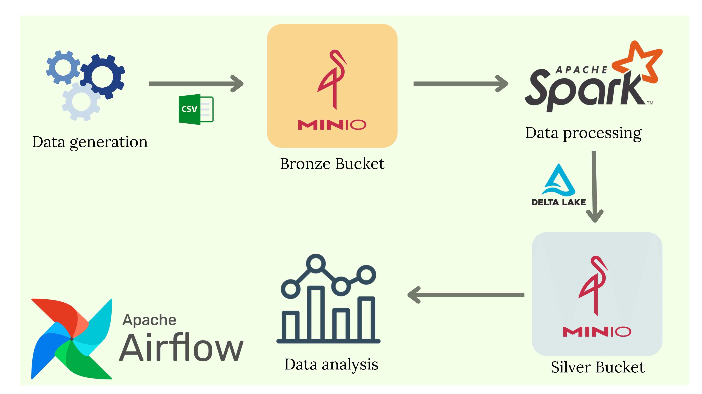

# TMDB Bronze to Silver Pipeline

This project builds a **Bronze → Silver** data pipeline using the TMDB dataset.  
It leverages **Apache Airflow**, **Apache Spark**, **MinIO**, and **PostgreSQL** as core technologies.

## Technologies Used
- **Apache Airflow**: Workflow orchestration
- **Apache Spark**: Big data processing
- **MinIO**: S3-compatible object storage
- **PostgreSQL**: Metadata database (used by Airflow)
- **Docker-Compose**: For setting up the environment easily

## Pipeline Flow

1. CSV files from the `datasets/` folder are uploaded to MinIO.
2. The DAG (`final_project_dag.py`) runs inside Airflow to:
   - Load raw data into the **Bronze** layer.
   - Transform and clean data using Spark.
   - Save structured data into the **Silver** layer as Delta tables.
3. At the end, a ready-to-query **Silver** layer is generated for analysis.

## How to Start
First, bring up the Docker environment. To do this, navigate to the directory where the docker-compose.yaml file is located and run:
```bash
cd 01_airflow_spark_minio
docker-compose up -d --build
```
Copy the datasets into the dataops directory inside the Spark container:
```bash
cd datasets
docker cp tmdb_5000_credits.csv spark_client:/dataops
docker cp tmdb_5000_movies.csv spark_client:/dataops
```
Copy the files from the scripts folder into their respective containers:
```bash
cd scripts
docker cp create_bucket.py spark_client:/dataops
docker cp credits_bronze_to_silver.py spark_client:/dataops
docker cp movies_bronze_to_silver.py spark_client:/dataops
docker cp spark_sql.ipynb spark_client:/dataops

docker cp final_project_dag.py airflow-scheduler:/opt/airflow/dags
```
From the Airflow Web UI (http://localhost:8080) (Username: airflow Password:airflow), go to the "Admin" → "Connections" section and create a new connection.
- **Connection ID:** `spark_ssh_conn`
- **Connection Type:** `SSH`
- **Host:** `spark_client`
- **Username:** `ssh_train`
- **Password:** `Ankara06`
- **Port:** `22`


After entering the details, click **Test** to verify the connection.If the test is successful, click **Save**.

From the Spark client, set the appropriate chmod and chown permissions for the scripts
```bash
docker exec -it spark_client bash
cd dataops
sudo chmod 777 create_bucket.py
sudo chmod 777 credits_bronze_to_silver.py
sudo chmod 777 movies_bronze_to_silver.py
sudo chmod 777 spark_sql.ipynb

sudo chown ssh_train:root create_bucket.py
sudo chown ssh_train:root credits_bronze_to_silver.py
sudo chown ssh_train:root movies_bronze_to_silver.py
sudo chown ssh_train:root spark_sql.ipynb
```
Trigger the DAG file from the Airflow UI. After all tasks are completed, start Jupyter Lab from the Spark container to run queries.
```bash
docker exec -it spark_client bash
cd /dataops
source airflowenv/bin/activate
pip install boto3
jupyter lab --ip 0.0.0.0 --port 8888 --allow-root
```
